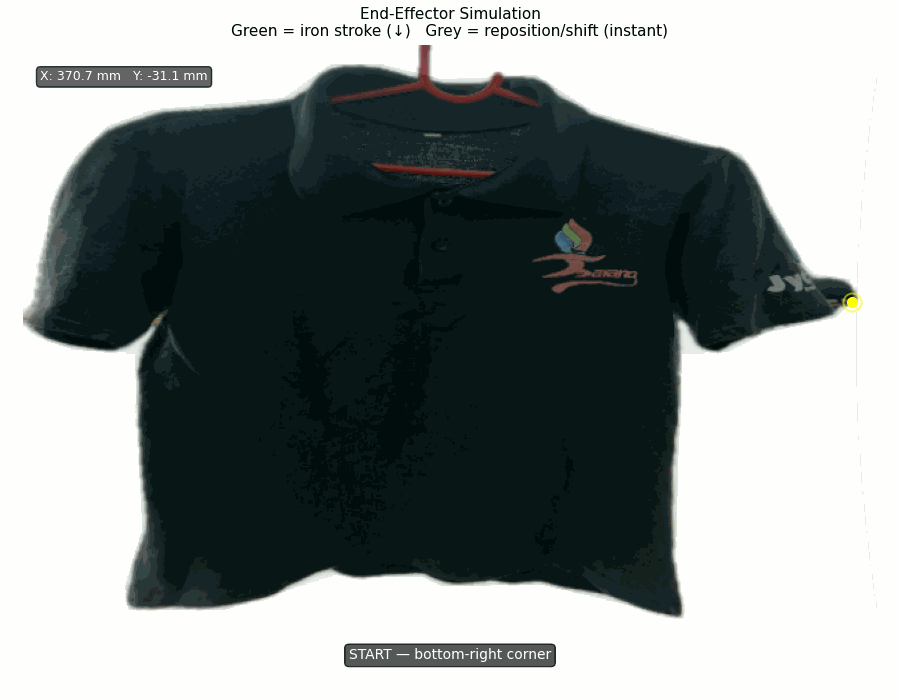

# Cartesian-Based Automatic Ironing Robot
### Vision-Guided Steam and Vacuum End-Effector

> **Published:** Design and Implementation of a Cartesian-Based Automatic Ironing Robot Using Vision-Guided Steam and Vacuum End-Effector — *ICAIT 2025 (Scopus-indexed)*

---

## Demo

**Hardware demo:**
[▶ Watch robot_demo.mp4](https://github.com/Jeswin010/cartesian-ironing-robot/blob/main/robot_demo.mp4)

**End-effector path simulation:**



> The demo video shows an early hardware test. The current codebase implements
> the complete pipeline — live webcam capture, GrabCut segmentation,
> pixel-to-real-world coordinate conversion, boustrophedon path generation,
> and full serial communication to Arduino.

---

## Overview

A fully functional autonomous ironing robot built on a Cartesian (2-axis) frame.
The robot captures a live image of the garment, segments it from the background,
generates a full-coverage ironing path, and drives the end-effector — combining
a steam iron and vacuum suction — across the cloth surface automatically.

---

## System Architecture

```
Webcam (live capture, press SPACE)
        │
        ▼
Undistortion (calibrated intrinsics)
        │
        ▼
GrabCut Segmentation  ──►  Garment Mask
        │
        ▼
Canny Edge Detection + Contour Extraction
        │
        ▼
Douglas-Peucker Simplification
        │
        ▼
Pinhole Model → Real-World Coordinates (mm) → Stepper Steps
        │
        ▼
Boustrophedon Path Generation
        │
        ▼
Serial (115200 baud) → Arduino → Stepper Motors + Steam + Vacuum
```

---

## Hardware

| Component | Details |
|---|---|
| Frame | Cartesian XY gantry (custom-built) |
| Motors | NEMA 17 stepper motors |
| Driver | DRV8825 on CNC Shield (Arduino Uno) |
| End-effector | Steam iron head + vacuum suction cup |
| Camera | USB webcam (calibrated, mounted overhead) |
| Hanger servo | MG996R — rotates garment for side 2 |
| Controller | Arduino Uno + Python via serial @ 115200 baud |

---

## Vision Pipeline

### 1. Live Capture + Undistortion
Webcam opens in a preview window — press SPACE to capture the garment image.
Lens distortion is corrected using calibrated intrinsics before processing.

### 2. GrabCut Segmentation
GrabCut models foreground (garment) and background colour distributions using
Gaussian Mixture Models, finding the optimal boundary via graph-cut.
Works on white shirts against white backdrops where HSV thresholding fails.

### 3. Contour Detection — Canny + Filters
Canny edge detection on the segmentation mask isolates only the garment boundary.
Contours filtered by area (>10%), dimensions (>20% width/height), and
aspect ratio (0.3–3.0) — automatically rejects hanger rods.
Douglas-Peucker simplification reduces point density while preserving shape.

### 4. Coordinate Conversion — Pinhole Model
```
X_mm = (u - cx) × Z / fx      fx=569.75, cx=339.38
Y_mm = (v - cy) × Z / fy      fy=568.89, cy=215.55, Z=750mm
```
Steps = mm × 20 (800 steps/rev ÷ 40mm/rev lead screw).

### 5. Path Generation — Boustrophedon
- Start: bottom-right of garment mask
- Even columns: reposition upward (ironing OFF, fast move)
- Odd columns: iron downward (steam + vacuum ON, slow move)
- Strip spacing = end-effector physical width (30mm → ~23px at Z=750mm)

---

## Serial Protocol (Python → Arduino)

| Command | Action |
|---|---|
| `MOVE X<mm> Y<mm> F<feed>` | Move end-effector to absolute position |
| `STEAM_ON` / `STEAM_OFF` | Activate/deactivate steam relay |
| `VACUUM_ON` / `VACUUM_OFF` | Activate/deactivate vacuum relay |
| `SERVO_ROTATE` | Rotate hanger 180° for side 2 |
| `HOME` | Return to origin |

Handshake protocol: Arduino replies `OK` after each command before Python sends the next.
This prevents buffer overflow and guarantees command ordering.

---

## Repository Structure

```
cartesian-ironing-robot/
├── ironing_pipeline.py      # Vision + path planning + serial pipeline (Python)
├── arduino_controller.ino   # Arduino sketch — stepper, relay, servo control
├── icait2025_paper.pdf      # Published conference paper
├── simulation.gif           # End-effector path animation
├── robot_demo.mp4           # Hardware demonstration
├── robot_setup.jpg          # Physical robot photograph
└── README.md
```

---

## Requirements

```bash
pip install opencv-python numpy matplotlib pyserial
```

Python >= 3.8

---

## Usage

```bash
# Webcam capture (live — press SPACE to capture)
python ironing_pipeline.py

# Offline testing with an image file
python ironing_pipeline.py --image "path/to/shirt.jpg"

# Execute on hardware via serial
python ironing_pipeline.py --run
```

To enable hardware execution, set in `ironing_pipeline.py`:
```python
SERIAL_ENABLED = True
SERIAL_PORT    = "COM3"   # your Arduino port
```

**Output:**
- 4-panel pipeline visualisation saved as `pipeline_output.png`
- Animated end-effector simulation (or live hardware execution with `--run`)
- Waypoint table printed to terminal: pixel → mm → stepper steps

---

## Paper

> Jeswin Devasia et al., "Design and Implementation of a Cartesian-Based Automatic
> Ironing Robot Using Vision-Guided Steam and Vacuum End-Effector",
> *Proceedings of ICAIT 2025.*

---

## Author

**Jeswin Devasia**

B.Tech — Mechatronics

